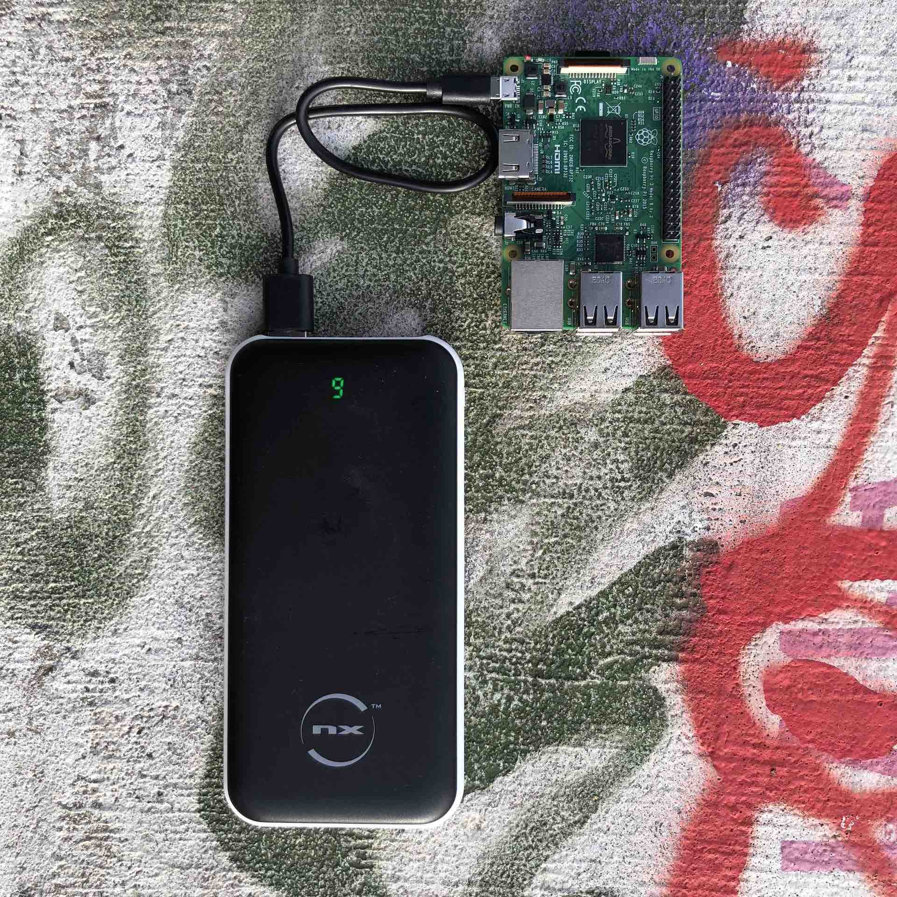
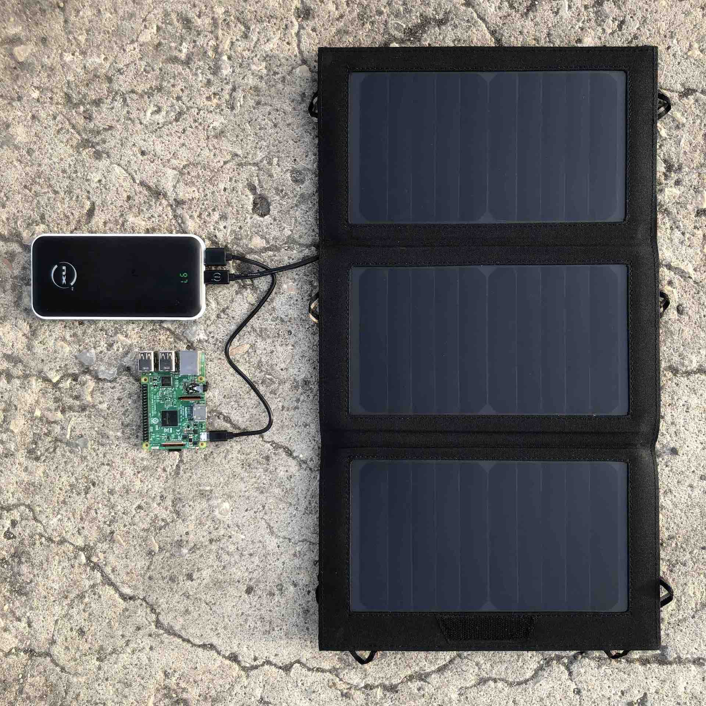
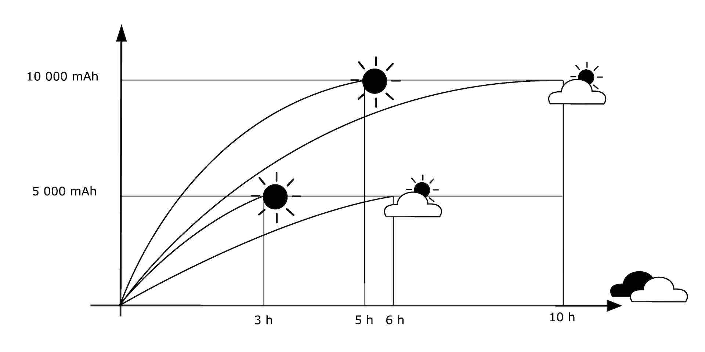

# solar server

This is a solar-powered web-server. It is a prototype developed as part of an open research that explores what the Internet may look like if it was powered by self-organised, local communities, on renewable energies. There are two main considerations in exploring such alternatives, on one hand how do we make information networks more sustainable, and on the other hand how do we empower people to better understand the underlying technology we rely on to take control back. This is only a first step in the process. This article overviews the key findings and underlying principles behind the prototype.

# Hardware

- Raspberry Pi

The server is a Raspberry Pi, a single board computer that runs on low voltage.

Since late 2021, and at the time of this experiment by mid-2022, the shortage of semiconductors had impacted the production of Raspberry Pis making it impossible to buy a new one from the official resellers. For the first time that I remember, the stress on natural ressources became tangible to the point that it affected my need to "consume". Instead, I had to rely on a friend lending me his Raspberry Pi. Just like when you go hiking and you are short in water, when ressources are sparse, we ought to reduce our consumption and share.

- Micro SD memory card

This is the hard drive of the Raspberry Pi. It stores the Operating System (OS) and the files of our server.

- Battery

The battery is a key component of the system since it is the power supply of the Raspberry Pi, which requires specific voltage and amperage to perform correctly.

For instance, the Raspberry Pi 4 requires 5.1V / 3.0A DC whereas the Raspberry Pi 3B requires 5V/2.5A DC. For this experiment I used a lithium battery, which is the most common type of batteries you'd find in end-consummers shops. Lithium batteries cannot be charged at the same time that they supply power, or at least it dammages them. This means that you'd need to charge your battery with the solar panel first, then unplug the solar panel to power your server. Your server is then only powered discontinuously. What you want instead is to use an uninterruptible power supply (UPS) that can supply power while being charged, hence providing continuous power (as long as you have sun to harvest). The [PiJuice](https://uk.pi-supply.com/products/pijuice-standard) seems to be an interesting solution as a UPS for the Raspberry Pi, although I haven't tested it.

For this prototype, I used a 5V / 10.000mAh battery to power the Raspberry Pi 3B. The unit mAh means milli (1/1000) of Ampere hour. An ampere hour is a unit of electric charge, having dimensions of electric current multiplied by time, equal to the charge transferred by a steady current of one ampere flowing for one hour. So in our case, this basically means that our battery is able to output 10.000 mA per hour (or 5.000mA for 2 hours, or 1.000mA for 10 hours etc.). At idle, the Raspberry Pi 3B model consumes about 260 mA of current at 5.0 V, accordingy to some resources I found online. Which means my battery should be able to power the Raspberry Pi for 10.000 mAh / 260 mA = 38 hours, in theory, at idle.

- Solar panel

For this prototype, I used a very basic solar panel that is normally used to charge phones while hikings. According to the reseller, it provides 15W at a 19% efficiency and the charging curve should be something like this:

# Results

The server was able to run for 7 hours using 20% of battery while serving 2-3 requests per hour. If we apply a 80-20 rule, meaning that we maintain the battery meter between 20% and 80% charge to improve its performance and longevity, that gives us a range of 60% usage. Hence the battery could power the server for 21 hours during a single charging cycle.

# Software

The Raspberry Pi runs on [Raspberry Pi OS](https://www.raspberrypi.com/software/), a Linux distribution.

The server is built using a static site generator (SSG). As Wikipedia says _"a static website is a web page that is delivered to the user's web browser exactly as stored, in contrast to dynamic web pages which are generated by a web application. Consequently, a static web page often displays the same information for all users, from all contexts(...)"_ or as the Low-tech Magazine further explains _"static websites are thus based on file storage whereas dynamic websites depend on recurrent computation. Static websites consequently require less processing power and thus less energy."_

A SSG is a tool that generates static websites based on raw data and templates. Because SSG create webpages in advance instead of on demand, they do not require as much server requests as with a content management system (CMS) like WordPress, making webpages lightweight and faster to load. There are many SSG around, some of the most popular being Hugo, Jekyll, Gatsby or Next.js. 

# Related articles

To go further on the topic and for more detailed explanations about some of the key technologies at use here, please see the below articles:

- What I know about solar energy so far (coming soon)
- What is a server and how does the Internet (mostly) work (coming soon)
- How do Lithium batteries work (coming soon)

# Inspiration & References

- Kris De Decker for Low-Tech Magazine, _"How to Build a Low-tech Website?"_, 2018 [link](https://solar.lowtechmagazine.com/2018/09/how-to-build-a-lowtech-website.html)
- Tega Brain, Alex Nathanson and Benedetta Piantella, _"Solar protocol"_ , 2021 [link](http://solarprotocol.net/)
- _"Solar Power for Artists"_ [link](https://www.solarpowerforartists.com/)
- Gauthier Roussilhe for the Green Web Foundation, _"Towards a Fossil-Free Internet: The Fog of Enactment"_, 2021 [link](https://www.thegreenwebfoundation.org/publications/report-fog-of-enactment/)
- Cloudflare, _"What is a static site generator?"_, [link](https://www.cloudflare.com/en-gb/learning/performance/static-site-generator/)

